.. include:: ../../definition.txt

管理者ガイド
=============

ログイン
----------------------------------------
1.管理画面「|RELATE_TOP_URL_DEVELOPMENT|」にアクセスします。

2.画面右上の「サインイン」を選択します。

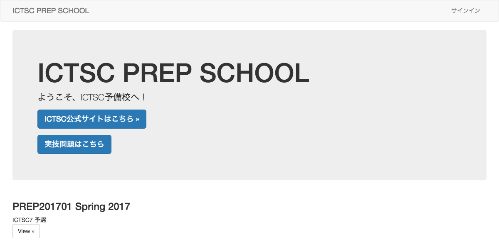

3.「ICTSC PREP SCHOOLのユーザ名とパスワードでサインイン」を選択します。

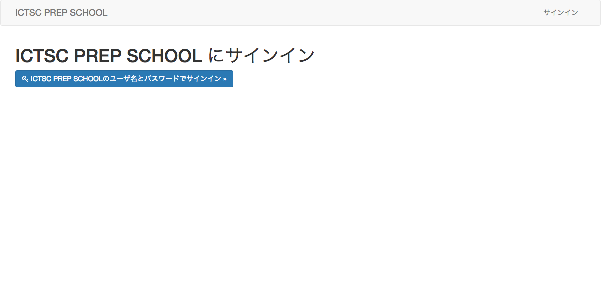

4.ユーザー名とパスワードを入力し、「サインイン」を選択します。

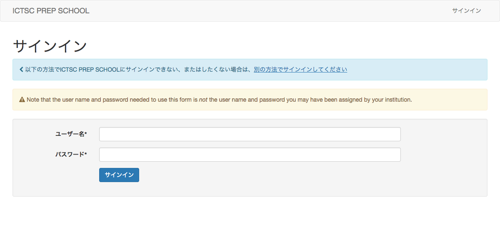

5.画面右上にログインしたユーザー名が表示されていることを確認します。

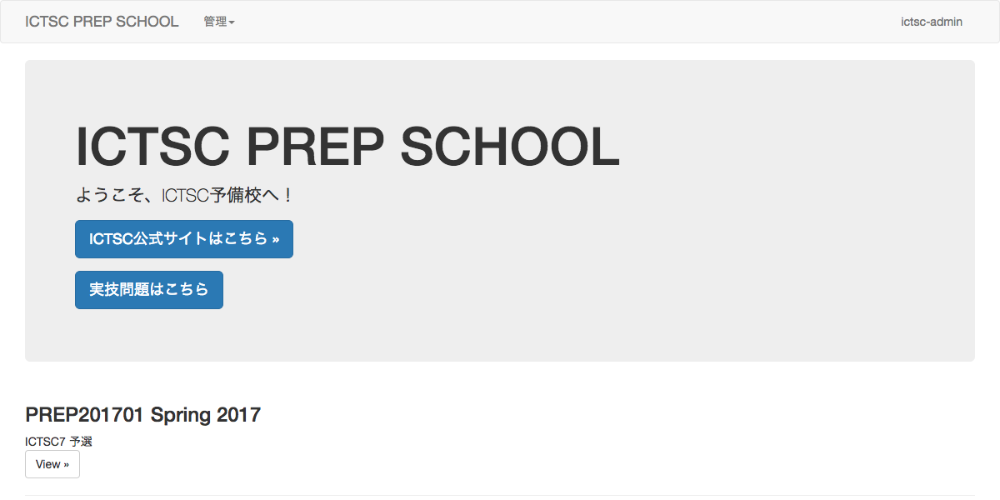

----

参加者アカウントの作成
----------------------------------------
※ログインをしていることが前提です。

1.管理画面「|RELATE_DJANGO_ADMIN_URL|」にアクセスします。

2.アカウント > ユーザー を選択します。

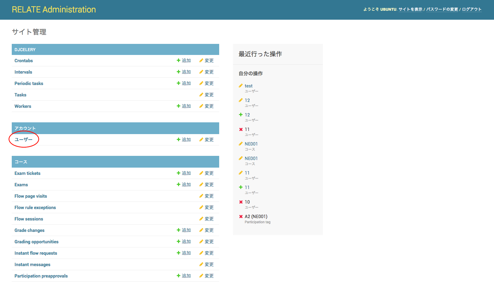

3.画面右上の ユーザーを追加＋ を選択します。

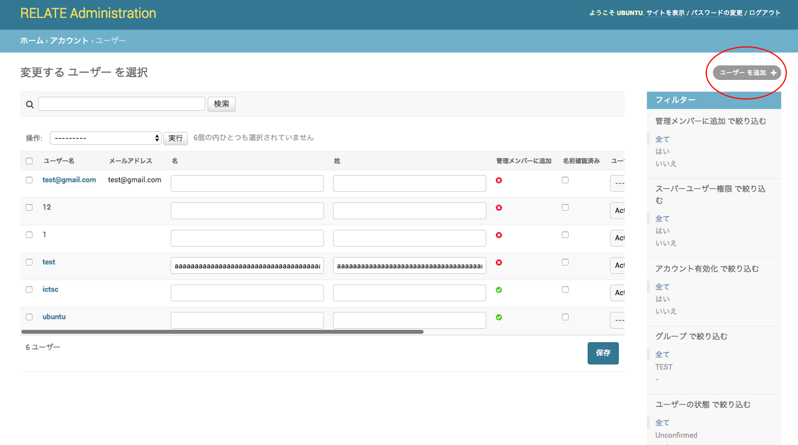

4.ユーザー名とパスワードを入力し、　保存して編集を続ける　を選択します。

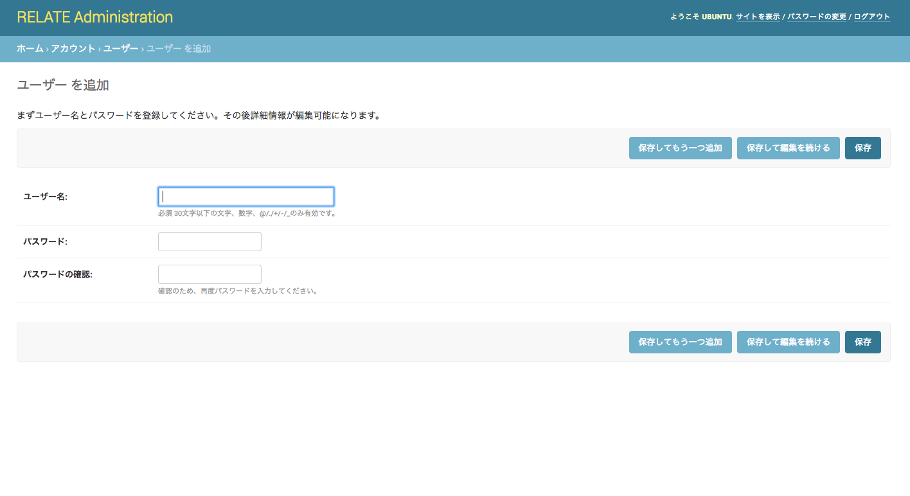

5.ユーザーの状態 を Active　を選択します。

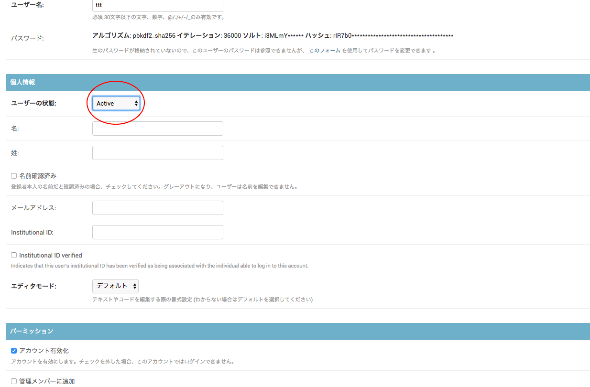

6.画面右上の保存を選択します。

7.以上で参加者アカウントの作成が完了です。

----

コースの登録
----------------------------------------

relateでははじめに、利用するにあたってcourse(コース)というデータを定義します。

これは、実際の学校でいうところの科目に相当します。

(e.g. 数学Ⅰ・数学Ⅱ・数学Ⅲ、化学・生物)

ICTSC予備校では、「ICTSC201x 第◯次予選問題」などといったコースを定義すると良いでしょう。

また、各ジャンルごとに分けるのであれば「サーバ系問題　01」、「ネットワーク系問題　01」といった定義も良いでしょう。

1.コースを管理するgitリポジトリを作成します。

2.コースを定義する course.yml ファイルを作成します。

以下に、一例を示します。

また、過去の予選問題の一部をrelateに移植したリポジトリがありますので、必要に応じて参照ください。「https://github.com/tar-xzvff/relate-course-test」

.. code-block:: yaml

    chunks:

    -
        title: "<ここにタイトルを入れる>"
        id: ictsc-prep
        rules:
        -   if_before: end_week 3
            weight: 100

        -   weight: 0

        content: |
            # Welcome to the course!
            Please take our introductory [quiz](flow:quiz-intro).

3.gitリポジトリに course.yml を追加します。

4.gitリポジトリに設定するためのDeploy keyの作成します。

5.gitリポジトリにDeploy keyを設定します。

6.新しいコースをセットアップする を選択します。

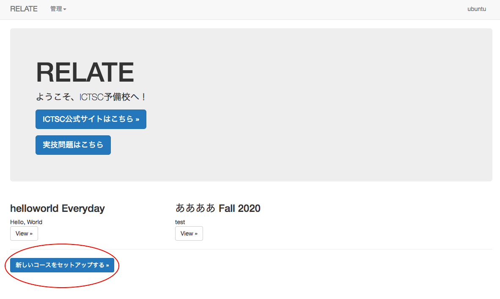

7.フォーム内に情報を入力・選択します。

::

    - Course identifier(コース識別子)
        - http://[予備校]/course/[コース識別子]/
        - 一意なIDとなる
        - 各コースTOPページのURLとなる
        - 空白は使用できない
    - Course name(コース名)
        - 予備校TOPページでコース概要のようになる
    - Course number(コース番号)
        - 予備校TOPページでコースタイトルのようになる
    - Time Period(期間)
        - コース番号の横にでる
        - 表向きの公開期限 (実際関係ないです)
    - Start date(開始日)
        - 公開する内部的な期日
    - End date(終了日)
        - 公開終了する内部的な期日
    - Only visible to course staff(このコースはスタッフだけが閲覧できるようにする)
        - チェックすると、関係者以外には見えない様になる
    - Listed on main page(メインページに掲載)
        - チェックすると、予備校TOPページに出ます
    - Accepts enrollment(登録を受け入れる)
        - チェックすると、一般ユーザーが該当コースに登録することができる様になる。登録できないと、問題に解答することができないし見れない。
    - Git source
        - 該当コースの問題が格納されているGitのURLを指定
        - 例 : git@github.com:hogehoge/example.git
        - 手順1で作成したGitリポジトリのURLを入力します
    - SSH private key(SSH 秘密鍵)
        - gitのレポジトリに登録されている秘密鍵
    - Course root in repository
        - 該当コースのディレクトリがGitのTOPじゃないときにここで指定する
        - 例 : /course/ictsc
    - Course file
        - 該当コースのTOPを記述したyamlファイル
        - デフォルト: course.yml
    - Event file
        - イベント情報を記述したyamlファイル
        - デフォルト: events.yml
    - Enrollment approval required(登録の承認が必要)
        - チェックすると、ユーザーが コースに登録する をクリックすると登録待ち状態となり、管理者が許可するまでは問題を解けなくなる
    - Prevent preapproval by institutional ID if not verified?
        - チェックしない
    - Enrollment required email suffix(登録を許可するメールアドレスサフィックス)
        - メールアドレスの"@"後のホワイトリスト
        - 入力しない
    - From email
        - 自動送信メールのFROMに使用される
        - admin@prep-dev.icttoracon.netを入力
    - 通知先メールアドレス
        - コースに関する通知受け取り先として使用される
        - admin@prep-dev.icttoracon.netを入力
    - Course language forcibly used
        - コースの言語を強制的に決める
        - 初期値(Default disabled)のまま

8.下部にある Validate and create をクリックします。

9.以上でコースの追加が完了です。

----

問題の定義
----------------------------------------

問題は、yml形式で定義します。

詳しくは、「https://documen.tician.de/relate/flow.html」を参照ください。

また、過去の予選問題の一部をrelateに移植したリポジトリがありますので、必要に応じて参照ください。「https://github.com/tar-xzvff/relate-course-test」

yml形式で書くために、サンドボックスが提供されています。

これにより、問題の作成とプレビューが容易になります。

問題検証用のサンドボックスの使い方
~~~~~~~~~~~~~~~~~~~~~~~~~~~~~~~~~~

1.いずれかのコースをクリックします。

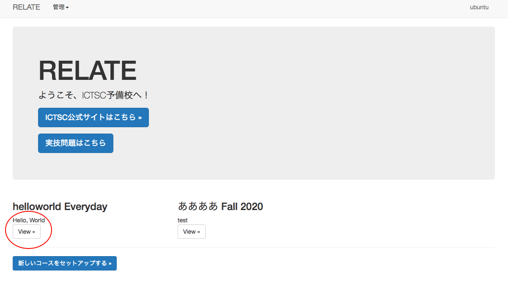

2.コンテンツ -> ページサンドボックス をクリックします。

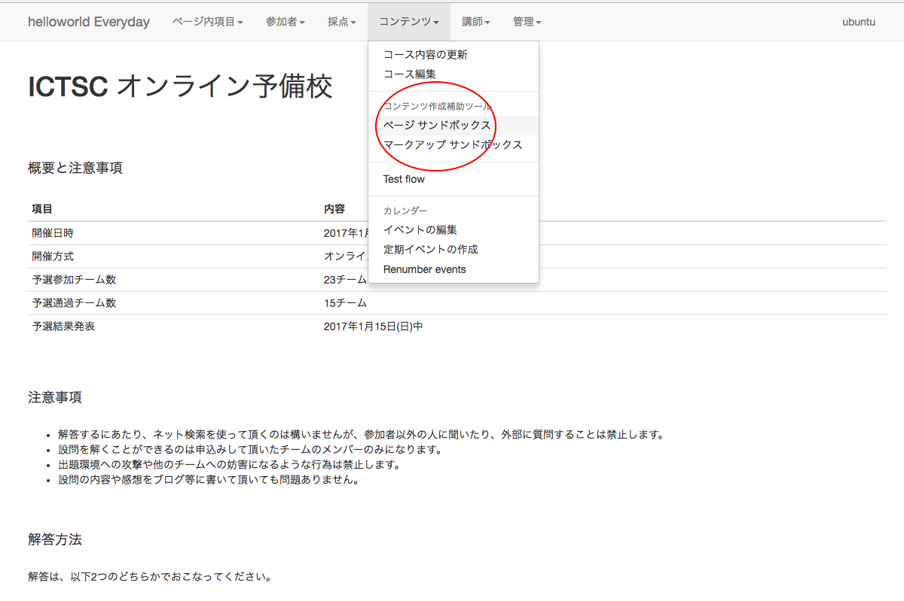

3.問題ページ毎の内容を記述します。

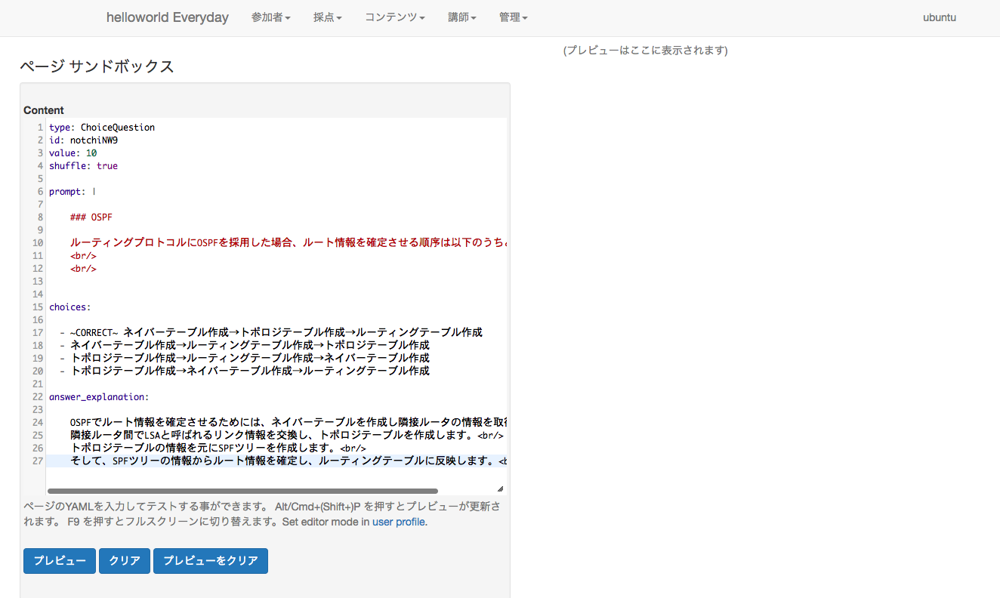

4.プレビューをクリックします。（解説内容も表示されます。）

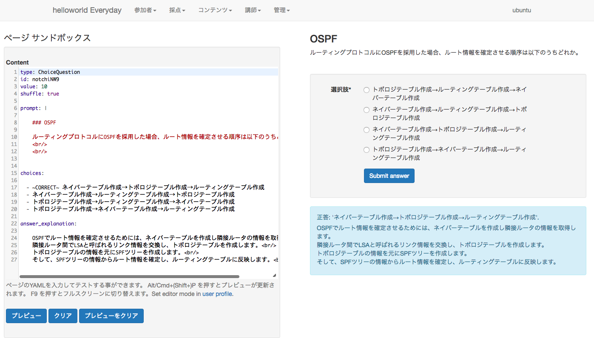

問題の追加・編集
~~~~~~~~~~~~~~~~~~~~~~~~~~~~~~~~~~

問題を編集すると、過去の問題も編集されます。

1.登録したGitリポジトリをローカルの環境にcloneします。(すでにclone済みの場合は、そのディレクトリへ移動してください)

2.ローカルに編集用のブランチを作成します。(例: git branch add/ictsc7_yosen_network2)

3.該当コースのディレクトリに移動し、questionディレクトリを開きます。

4.追加・編集したい問題のyamlファイルを追加・編集します。(ここでサンドボックスのプレビューを使用すると良いです)

5.１つ上のディレクトリに移動し、flowsディレクトリ内のyamlファイルを開きます。

6.追加したい問題へのリンクを追記します。

7.Gitにプッシュします

8.Gitでmasterブランチにプルリクエストを作成します。

9.プルリクがマージされたら予備校のTOPページを開きます

10.該当コースをクリックします。

11.コンテンツ > コース内容の更新を選択します。

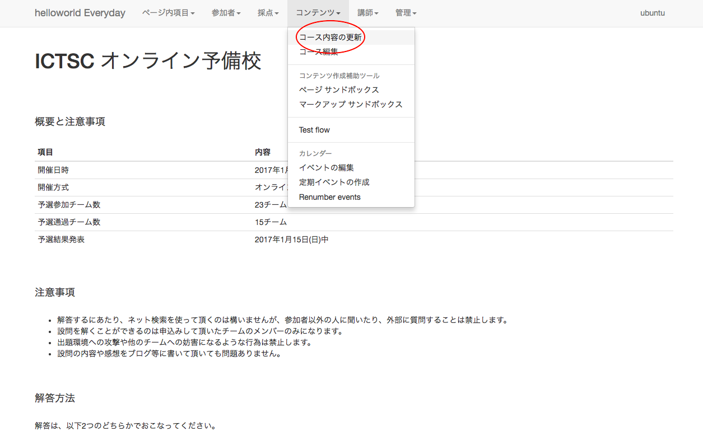

12.Fetch and update を選択します。

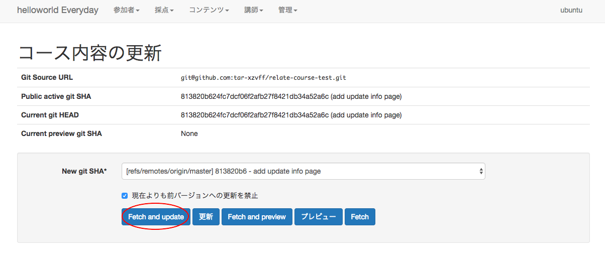

13.Fetch successful. と Update applied. が表示されたら、問題の追加・編集が完了です。

問題の削除
----------------------------------------

1.登録したGitリポジトリをローカルの環境にcloneします。(すでにclone済みの場合は、そのディレクトリへ移動してください)

2.ローカルに編集用のブランチを作成します。(例: git branch delete/ictsc7_yosen_network2)

3.該当コースのディレクトリに移動し、questionディレクトリを開きます。

4.削除したい問題のyamlファイルを削除します。

5.１つ上のディレクトリに移動し、flowsディレクトリ内のyamlファイルを開きます。

6.削除したい問題へのリンクを削除します。

7.Gitにプッシュします。

8.Gitでmasterブランチにプルリクエストを作成します。

9.プルリクがマージされたら予備校のTOPページを開きます。

10.該当コースをクリック

11.コンテンツ > コース内容の更新をクリックします。

12.Fetch and update をクリックします。

13.Fetch successful. と Update applied. が表示されたら、問題の削除が完了です。