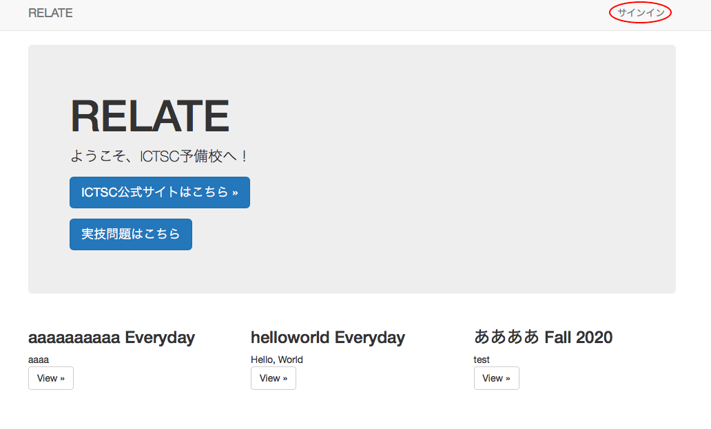
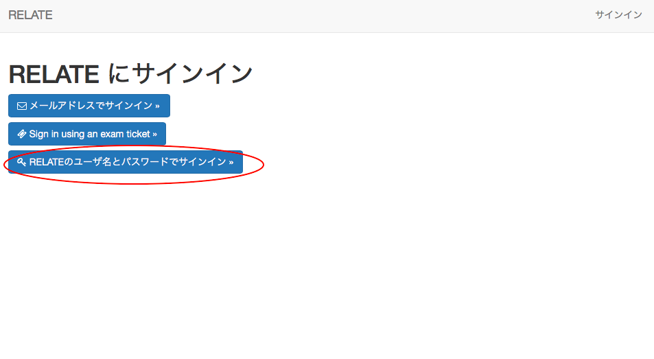
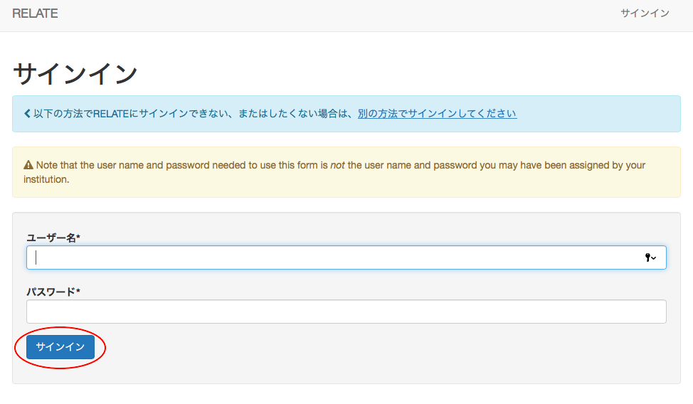
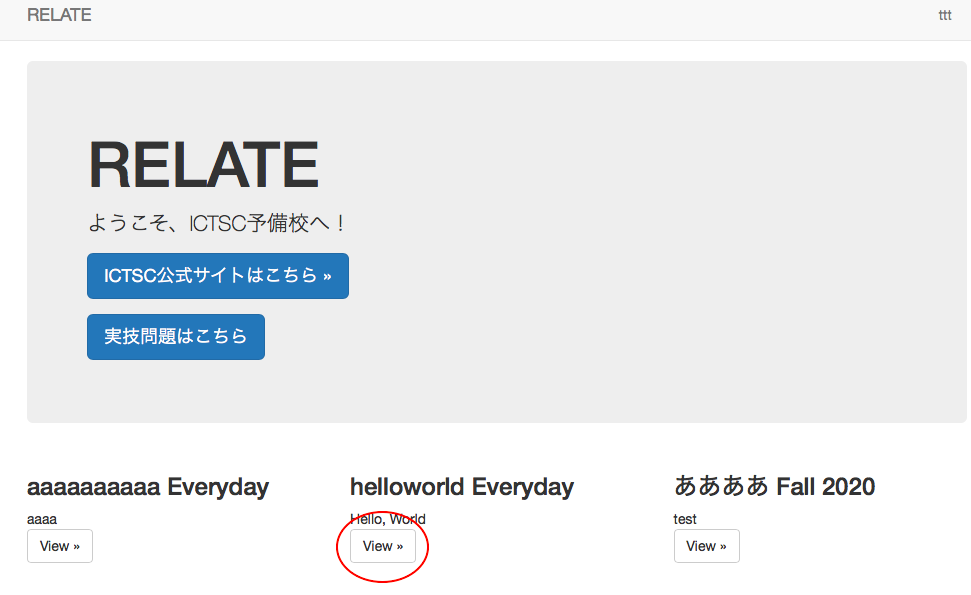
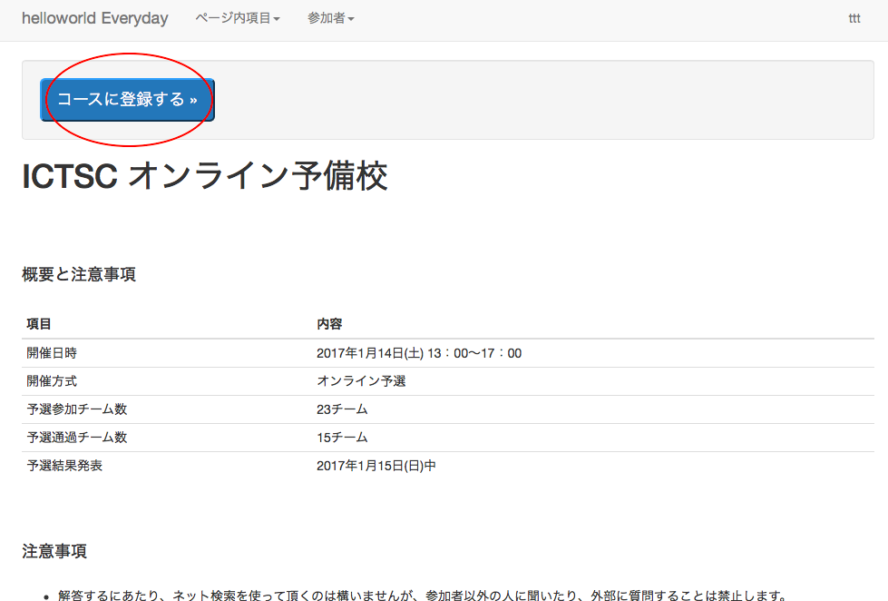
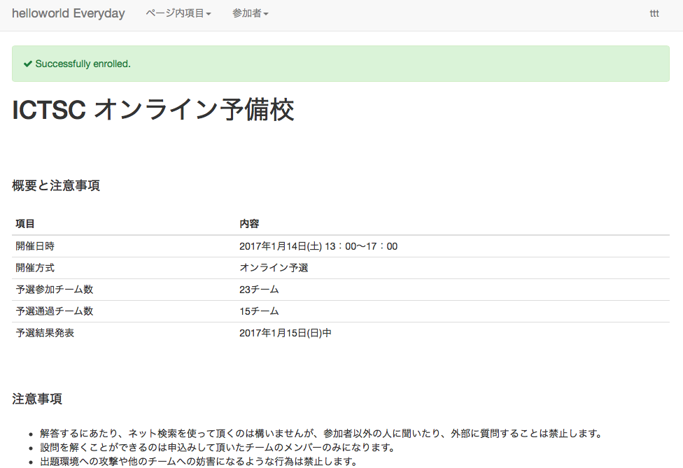
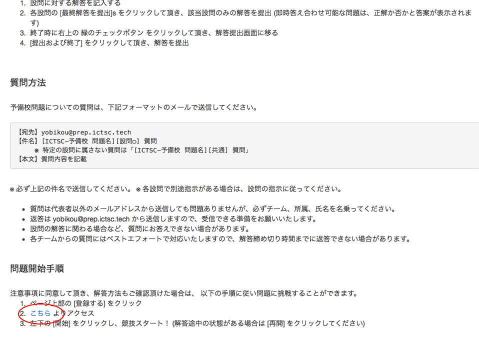
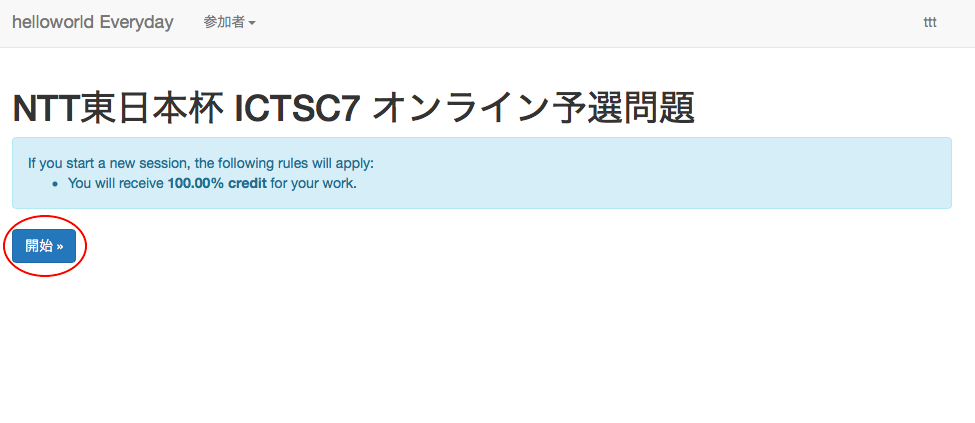

参加者ガイド
=============

サインイン
-------------

1.ページ右上にある サインイン をクリックします。

2.一番下のユーザー名とパスワードでサインイン をクリックします。

3.予備校運営から発行された認証情報を元に、ユーザー名とパスワードを入力し、サインインをクリックします。

4.サインインし、右上にユーザー名が表示されている事を確認

問題の挑戦方法
-------------

1.予備校TOPページから、挑戦したコースをクリックします。

2.コースに登録する をクリックします。

3.Successfully enrolled. と表示されれば登録完了です。

4.下へスクロールしていただき、 こちら をクリックします。

5.開始 をクリックすることで、問題が開始されます。

問題の解答方法
-------------

コースのTOPページにも記載しております。

【最終提出パターン】

設問に対する解答を記入する
各設問の [解答を保存] をクリック
終了時に右上の 緑のチェックボタン をクリックして頂き、解答提出画面に移る
[提出および終了] をクリックして頂き、解答を提出

【随時提出パターン】

設問に対する解答を記入する
各設問の [最終解答を提出] をクリックして頂き、該当設問のみの解答を提出 (即時答え合わせ可能な問題は、正解か否かと答案が表示されます)
終了時に右上の 緑のチェックボタン をクリックして頂き、解答提出画面に移る
[提出および終了] をクリックして頂き、解答を提出